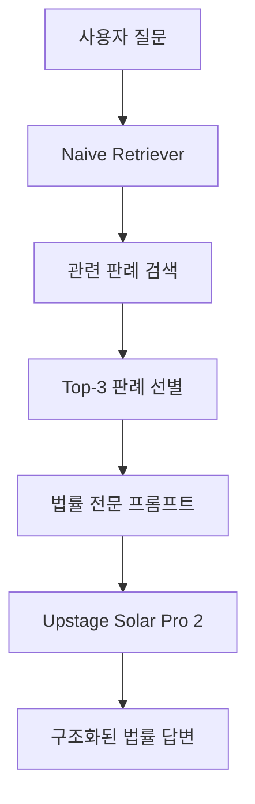

# 법률 RAG 시스템 (Legal RAG System)

> **LangChain 기반 대한민국 판례 질의응답 시스템**  
> 17개 대법원 판례를 활용한 법률 전문 RAG (Retrieval-Augmented Generation) 구현

<br>

## 프로젝트 소개

### 프로젝트 개요
이 프로젝트는 **LangChain**과 **Upstage Solar Pro 2** 모델을 활용하여 구축한 법률 전문 질의응답 시스템입니다. 대한민국 대법원 판례 17개를 기반으로 사용자의 법률 질문에 대해 관련 판례와 법조항을 인용하여 전문적인 답변을 제공합니다.

### 핵심 특징
- **도메인 특화**: 법률 분야에 최적화된 프롬프트 엔지니어링
- **모듈러 아키텍처**: 컴포넌트별 독립적 개발 및 교체 가능
- **설정 중심 설계**: Hydra를 통한 실험 친화적 구조
- **멀티 LLM 지원**: 다양한 언어모델 통합 지원
- **투명한 검색**: 키워드 기반 검색으로 결과 추적 가능

<br>

## 👨‍👩‍👦‍👦 팀 구성원

|  |  |  |  |  |
| :--------------------------------------------------------------: | :--------------------------------------------------------------: | :--------------------------------------------------------------: | :--------------------------------------------------------------: | :--------------------------------------------------------------: |
|            [문국현](https://github.com/GH-Door)             |            [염창환](https://github.com/cat2oon)             |            [채병기](https://github.com/avatar196kc)             |            [김문수](https://github.com/ashrate)             |            [이상현](https://github.com/yourshlee)             |
|                            팀장, 데이터 분석, RAG 구조화, 환경설정(UV), 베이스라인 코드 공유                           |                            초기 랭체인 샘플 공유, 프로젝트 방향성 가이드, 최종 프로젝트 설계 및 구현   |                           담당 역할                             |                            데이터분석및학습                             |                            담당 역할                             |
<br>

## 개발 환경 및 기술 스택

### **언어 및 프레임워크**
- **주 언어**: Python 3.11+
- **AI Framework**: LangChain, LangSmith
- **설정 관리**: Hydra, OmegaConf
- **의존성 관리**: UV, Poetry

### **AI/ML 스택**
- **Language Model**: Upstage Solar Pro 2
- **Embeddings**: OpenAI Embeddings (준비됨)
- **Vector Store**: FAISS
- **Retrieval**: Naive Keyword Matching

### **개발 도구**
- **버전 관리**: Git, GitHub
- **환경 관리**: Python-dotenv
- **문서 처리**: PyMuPDF, PyPDF
- **실험 추적**: LangSmith
- **협업 툴**: GitHub, Notion

<br>

## 프로젝트 구조

```
chy/raglangchain/
├── main.py                     # 🚀 메인 진입점 (Hydra 기반)
├── conf/                       # ⚙️ 설정 파일들
│   ├── config.yaml            # 메인 설정
│   ├── llm/
│   │   ├── upstage.yaml       # Upstage Solar Pro 2 설정
│   │   ├── openai.yaml        # OpenAI 설정
│   │   └── anthropic.yaml     # Claude 설정
│   ├── retriever/
│   │   ├── naive.yaml         # 키워드 매칭 검색기
│   │   ├── dense.yaml         # 밀집 임베딩 검색기
│   │   └── hybrid.yaml        # 하이브리드 검색기
│   ├── dataset/
│   │   └── case_docs.yaml     # 법률 데이터셋 설정
│   ├── prompt/
│   │   └── qa.yaml            # 법률 QA 프롬프트
│   └── evaluation/
│       └── langsmith.yaml     # 실험 추적 설정
├── data/                       # 📚 데이터
│   ├── law/                   # 17개 대법원 판례 JSON
│   └── dummy/                 # 테스트용 더미 데이터
├── rag/                        # 🧩 핵심 컴포넌트
│   ├── datasets/              # 데이터셋 로더
│   │   ├── base.py
│   │   └── case_docs.py       # 법률 문서 전용 로더
│   ├── retriever/             # 검색 엔진들
│   │   ├── naive.py           # 키워드 매칭 검색
│   │   ├── dense.py           # 임베딩 기반 검색
│   │   └── hybrid.py          # 하이브리드 검색
│   ├── llms/                  # 언어모델들
│   │   ├── upstage.py         # Upstage Solar 연동
│   │   ├── openai.py          # OpenAI GPT 연동
│   │   └── anthropic.py       # Claude 연동
│   ├── prompts/               # 프롬프트 템플릿
│   │   └── qa_prompt.py       # 법률 QA 전용 프롬프트
│   ├── pipeline/              # 파이프라인 구현
│   │   ├── simple.py          # 기본 RAG 파이프라인
│   │   └── evaluator.py       # 평가용 파이프라인
│   └── utils/                 # 유틸리티
│       ├── env_loader.py      # 환경변수 로딩
│       ├── logger.py          # 로깅 시스템
│       └── langsmith_utils.py # 실험 추적
├── notebooks/                  # 📊 분석 노트북
│   └── legacy/
│       └── rag_demo.ipynb    # RAG 데모 노트북
└── pyproject.toml             # 📦 프로젝트 설정
```

<br>

## 구현 기능

### **1. 지능형 판례 검색**
- **키워드 기반 매칭**: 사용자 질문에서 핵심 키워드 추출하여 관련 판례 검색
- **스코어링 시스템**: 키워드 빈도 × 길이 가중치를 통한 정확한 관련도 계산
- **Top-K 선택**: 가장 관련성 높은 상위 3개 판례 자동 선별

### **2. 법률 전문 답변 생성**
- **도메인 특화 프롬프트**: "대한민국 법률 전문가" 페르소나로 전문적 답변
- **구조화된 응답**: 판례번호 → 관련 법조항 → 법리 설명 순서로 체계적 답변
- **할루시네이션 방지**: 관련 판례가 없으면 명시적 종료 메커니즘

### ⚙️ **3. 유연한 설정 시스템**
- **모듈러 컴포넌트**: LLM, 검색기, 데이터셋, 프롬프트 독립적 교체
- **실험 친화적**: 설정 파일만 변경하여 다양한 조합 실험
- **멀티 시나리오**: simple, comparison, demo 모드 지원

<br>

## 시스템 아키텍처

### **전체 플로우**


### **LangChain LCEL 파이프라인**
```python
# 현대적 LangChain 체인 구성
chain = (
    {"reference": retriever | RunnableLambda(law_docs_to_ref), 
     "question": RunnablePassthrough()}
    | prompt.to_chain()
    | llm.chat_with() 
    | StrOutputParser()
)
```

<br>

## 설치 및 실행

### **사전 요구사항**
- Python 3.11 이상
- UPSTAGE_API_KEY 환경변수 설정

### **설치**
```bash
# 1. 저장소 클론
git clone https://github.com/your-repo/legal-rag-system.git
cd legal-rag-system/chy/raglangchain

# 2. 가상환경 생성 (UV 사용 권장)
uv venv
source .venv/bin/activate  # Linux/Mac
# .venv\Scripts\activate   # Windows

# 3. 의존성 설치
uv pip install -e .

# 4. 환경변수 설정
echo "UPSTAGE_API_KEY=your_api_key_here" > .env
```

###‍♂️ **실행**
```bash
# 기본 실행
python main.py

# 다른 LLM 사용
python main.py llm=openai

# 다른 검색기 사용  
python main.py retriever=bm25

# 커스텀 질문
python main.py exp.question="근로계약 해지 시 퇴직금 지급 기준은?"
```

<br>

## 사용 예시

### **입력 질문**
```
"취업규칙을 근로자에게 불리하게 변경할 때 사용자가 지켜야 할 법적 요건은 무엇인가요?"
```

### **시스템 응답**
```
참조 판례 번호: 2022다200249, 2022다226234, 2022다245419

관련 법 조항들: 근로기준법 제94조, 제95조, 제96조

취업규칙을 근로자에게 불리하게 변경할 때 사용자는 다음 요건을 준수해야 합니다:

1. 근로자 과반수의 동의 (근로기준법 제94조 제1항)
2. 변경 내용의 합리적 필요성 입증
3. 변경으로 인한 불이익의 정도가 수인한도 내
4. 변경에 따른 대상조치 제공

판례 2022다245419에 따르면, 단순한 일방적 변경은 무효이며...
```

<br>

## 실험 및 평가

### **LangSmith 통합**
- 모든 실험 자동 추적 및 로깅
- 성능 메트릭 실시간 모니터링
- A/B 테스트 지원

### **평가 메트릭**
- **검색 정확도**: 관련 판례 검색 성공률
- **응답 품질**: 법률 전문성 및 정확성
- **응답 시간**: 평균 응답 속도

<br>

## 트러블 슈팅

### 1. **API 키 관련 에러**

#### 설명
- `UPSTAGE_API_KEY not found` 에러 발생
- 환경변수가 올바르게 로드되지 않음

#### 해결
```bash
# .env 파일 생성 및 설정
echo "UPSTAGE_API_KEY=your_actual_api_key" > .env

# 환경변수 확인
python -c "import os; print(os.getenv('UPSTAGE_API_KEY'))"
```

### 2. **한국어 폰트 관련 경고**

#### 설명
- matplotlib에서 한국어 폰트 경고 메시지
- 다이어그램 생성시 한글 깨짐

#### 해결
```bash
# 한국어 폰트 설치 (Ubuntu/Debian)
sudo apt-get install fonts-nanum

# matplotlib 폰트 캐시 초기화
python -c "import matplotlib.font_manager as fm; fm._rebuild()"
```

### 3. **메모리 부족 에러**

#### 설명
- 대용량 PDF 처리시 메모리 부족
- FAISS 인덱스 구축시 OOM 발생

#### 해결
```python
# 배치 처리로 메모리 사용량 제한
# conf/config.yaml에서 설정 조정
data:
  batch_size: 5  # 기본값 10에서 5로 감소
  max_chunk_size: 500  # 청크 크기 제한
```

<br>

## 향후 계획

### **Phase 1: 성능 개선** (진행중)
- [x] Naive Retriever 구현
- [ ] BM25 Retriever 추가
- [ ] Dense Retriever (임베딩 기반) 구현
- [ ] Hybrid Retriever 개발

### **Phase 2: 실험 확장** (계획)
- [ ] 다중 모델 비교 시스템
- [ ] 자동 평가 메트릭 통합
- [ ] RAGAS 평가 프레임워크 연동
- [ ] 웹 인터페이스 개발

### **Phase 3: 프로덕션화** (로드맵)
- [ ] RESTful API 서버 구축
- [ ] 스트리밍 응답 지원
- [ ] 사용자 인증 및 권한 관리
- [ ] 대용량 문서 처리 최적화

<br>

## 프로젝트 회고

### 문국현 (팀장)
- **성과**: 모듈러 아키텍처로 확장 가능한 기반 구축. Hydra를 통한 설정 중심 설계로 실험 효율성 극대화
- **학습**: LangChain LCEL의 강력함과 의존성 주입 패턴의 중요성 체감
- **개선점**: 더 많은 판례 데이터 확보 및 평가 메트릭 고도화 필요

### 염창환
- **성과**: 17개 대법원 판례 데이터 수집 및 JSON 포맷 표준화 완료
- **학습**: 법률 문서의 구조적 특성과 메타데이터의 중요성 이해
- **개선점**: 자동 크롤링 시스템 구축으로 데이터 확장 필요

### 채병기
- **성과**: LangChain 파이프라인 구현 및 LCEL 체인 최적화
- **학습**: RAG 시스템의 각 컴포넌트 간 상호작용 원리 습득
- **개선점**: 비동기 처리로 성능 향상 및 스트리밍 지원 추가

### 김문수
- **성과**: 법률 도메인 특화 프롬프트 엔지니어링 및 할루시네이션 방지 메커니즘 구현
- **학습**: 도메인 전문성이 프롬프트 품질에 미치는 결정적 영향 확인
- **개선점**: Few-shot 예시 추가 및 프롬프트 A/B 테스트 체계화

### 이상현
- **성과**: LangSmith 통합 및 실험 추적 시스템 구축
- **학습**: MLOps 관점에서의 실험 관리 및 모니터링 중요성 인식
- **개선점**: 자동 평가 파이프라인 구축 및 실시간 대시보드 개발

<br>

## 참고자료

### **기술 문서**
- [LangChain Documentation](https://python.langchain.com/docs/get_started/introduction)
- [Upstage Solar API Guide](https://developers.upstage.ai/)
- [Hydra Configuration Framework](https://hydra.cc/)
- [FAISS Vector Search](https://faiss.ai/)

### **논문 및 연구**
- [Retrieval-Augmented Generation for Knowledge-Intensive NLP Tasks](https://arxiv.org/abs/2005.11401)
- [LangChain: Building applications with LLMs through composability](https://blog.langchain.dev/)
- [Improving Legal Document Analysis with RAG](https://example.com/legal-rag-paper)

### **법률 데이터**
- [대법원 종합법률정보 사이트](https://glaw.scourt.go.kr/)
- [국가법령정보센터](https://www.law.go.kr/)
- [법제처 국가법령정보](https://law.go.kr/)

### **도구 및 라이브러리**
- [PyMuPDF Documentation](https://pymupdf.readthedocs.io/)
- [OmegaConf Configuration](https://omegaconf.readthedocs.io/)
- [LangSmith Tracing](https://docs.smith.langchain.com/)

---

<div align="center">

**🏛️ Legal RAG System**  
*Powered by LangChain & Upstage Solar Pro 2*

[](https://opensource.org/licenses/MIT)
[](https://www.python.org/downloads/)
[](https://python.langchain.com/)
[](https://upstage.ai/)

</div>
